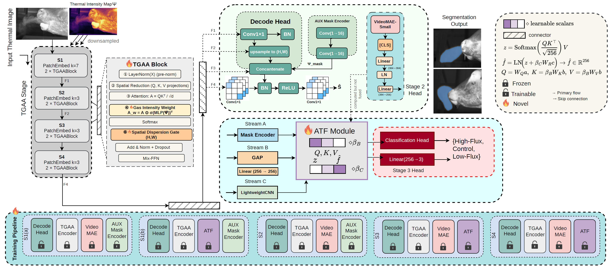

# TRACE

**TRACE** (Thermal Recognition Attentive-Framework for CO2 Emissions from Livestock) is a unified framework for per-frame CO2 plume segmentation and clip-level emission flux classification from mid-wave infrared (MWIR) thermal video. It combines a TGAA-augmented SegFormer backbone with an Attention-based Temporal Fusion (ATF) module, trained via a four-stage progressive curriculum.

---

## ✨ Highlights

- 🔬 **TGAA encoder**: gas-conditioned transformer encoder that incorporates per-pixel CO₂ intensity as a spatial supervisory signal to direct self-attention toward high-emission regions
- 🔗 **ATF module**: fuses mask, encoder, and CNN streams via cross-frame attention for clip-level flux classification
- 📋 **Four-stage training curriculum**: segmentation warmup → temporal alignment → ATF fusion → end-to-end joint training
- ⚡ Supports multi-GPU DDP training out of the box

---

## 🏗️ Architecture



---

## 🔄 Pipeline Overview

TRACE trains in 4 sequential stages:

```
Stage 1 — Segmentation Pretraining
  └─ TGAA-SegFormer on thermal overlay images
     S1(a): freeze TGAA encoder, train decode head only (BCE + Dice)
     S1(b): unfreeze TGAA encoder, jointly train with decode head and ATF (segmentation only)

Stage 2 — Temporal Alignment
  └─ Align ATF temporal stream to frozen VideoMAE-Small via MSE feature-alignment loss
     (VideoMAE is discarded after this stage — not used at inference)

Stage 3 — ATF Fusion
  └─ Train ATF module with classification head on clip-level flux labels

Stage 4 — End-to-End Fine-tuning
  └─ Joint optimization: L_total = λ_seg(BCE + Dice) + λ_cls * CE
     (λ_seg=1.0, λ_cls=0.5)
```

---

## 📦 Installation

### 1. Clone the repository

```bash
git clone https://github.com/taminulislam/trace.git
cd trace
```

### 2. Create the conda environment

```bash
conda env create -f environment.yml
conda activate trace
```

### 3. Install pip dependencies

```bash
pip install -r requirements.txt
```

> **Requirements:** Python 3.11, PyTorch >= 2.8, CUDA 12.8, transformers >= 4.40, timm >= 0.9

---

## 📂 Dataset

The CO2 Farm Thermal Gas Dataset is not publicly available yet. Please contact the authors to request access.

Expected dataset structure:

```
dataset/
├── SEQ_XXXX/
│   ├── images/          # Thermal overlay frames (.png)
│   ├── masks/           # Binary gas segmentation masks (.png)
│   └── overlays/        # Visualization overlays (.png)
annotations/
├── annotations.csv      # Frame-level labels (sequence, frame, class)
├── clips.csv            # Clip-level metadata (sequence, class, split)
└── split_train_val_test.csv
```

**Classes:** High-Flux (HF), Control (Ctrl), Low-Flux (LF)
**Split:** 18 train / 3 val / 3 test sequences

---

## 🚀 Training

### Full pipeline (all stages)

```bash
bash scripts/run_all.sh
```

### Individual stages

```bash
# Stage 1: Segmentation pretraining (S1a + S1b)
python src/train/train_segmentation.py

# Stage 2: Temporal alignment (VideoMAE teacher)
python src/train/train_temporal.py

# Stage 3: ATF Fusion (requires Stage 1 checkpoint)
python src/train/train_fusion.py \
    --seg_checkpoint outputs/checkpoints/segmentation/segmentation_latest.pt

# Stage 4: End-to-end fine-tuning (requires Stage 1, 2, 3 checkpoints)
python src/train/train_e2e.py \
    --seg_checkpoint outputs/checkpoints/segmentation/segmentation_latest.pt \
    --temporal_checkpoint outputs/checkpoints/temporal/temporal_latest.pt \
    --fusion_checkpoint outputs/checkpoints/fusion/fusion_latest.pt
```

### Key environment variables

| Variable | Default | Description |
|:---------|:--------|:------------|
| `ANNOTATIONS_CSV` | `annotations/annotations.csv` | Path to annotations file |
| `CLIPS_CSV` | `annotations/clips.csv` | Path to clips file |
| `CHECKPOINT_DIR` | `outputs/checkpoints` | Checkpoint save directory |
| `LOG_DIR` | `outputs/logs` | Log directory |
| `WANDB_DISABLED` | `false` | Set to `true` to disable W&B logging |

### Multi-GPU (DDP)

```bash
torchrun --nproc_per_node=2 src/train/train_segmentation.py
```

---

## 📊 Evaluation

```bash
python src/eval/evaluate.py \
    --checkpoint outputs/checkpoints/e2e/e2e_latest.pt \
    --annotations_csv annotations/annotations.csv \
    --clips_csv annotations/clips.csv
```

---

## 🤗 Pre-trained Models

Pre-trained checkpoints will be available on HuggingFace Hub:

> [HuggingFace model page — coming soon]

| Checkpoint | Stage | Description |
|:-----------|:------|:------------|
| `trace-segmentation` | Stage 1 | TGAA-SegFormer segmentation |
| `trace-temporal` | Stage 2 | VideoMAE temporal alignment |
| `trace-fusion` | Stage 3 | ATF fusion model |
| `trace-e2e` | Stage 4 | Full end-to-end TRACE model |

---

## 📁 Project Structure

```
TRACE/
├── src/
│   ├── data/            # Dataset, augmentation, clip sampling
│   ├── models/          # TRACE, TGAA, ATF, temporal encoder
│   ├── train/           # Per-stage training scripts
│   ├── eval/            # Evaluation
│   └── utils/           # Config dataclasses, trainer utilities
├── scripts/             # Shell runners + comparison scripts
│   ├── run_all.sh       # Full pipeline runner
│   ├── run_segmentation.sh
│   ├── run_temporal.sh
│   ├── run_fusion.sh
│   ├── run_e2e.sh
│   ├── run_eval.sh
│   ├── run_stage5_eval.sh
│   └── compare_results.py
├── assets/              # Figures (architecture diagram, etc.)
├── annotations/         # Dataset split CSVs
├── requirements.txt
└── environment.yml
```

---


---

## 📄 License

This project is licensed under the MIT License. See [LICENSE](LICENSE) for details.
